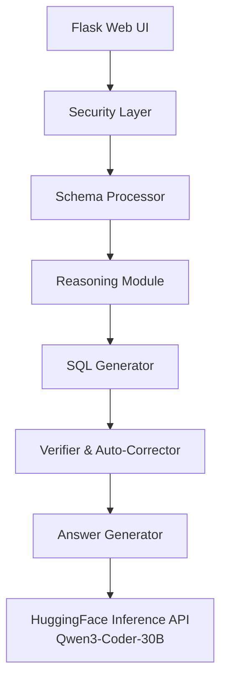

# NL-to-SQL: Interpretable Natural Language to SQL Pipeline

A **modular NL-to-SQL system** for data teams who need **reviewable, safe SQL generation**. Every major decision in the pipeline is explicit and transparent, designed for scenarios where generated SQL must be understood and vetted by humans before execution.

---

## Quick Start

```bash
# Install dependencies
uv sync

# Configure HuggingFace API
echo "HF_API_TOKEN=hf_your_token_here" > .env

# Run the application
uv run python app.py

# Open browser to http://localhost:5000
```

### Example Query

**Input:** "Show me total revenue by product category"

**Reasoning Output:**
- Tables needed: orders, products, categories
- Join path: orders → products (product_id) → categories (category_id)
- Aggregation: SUM(orders.total_amount)
- Grouping: categories.name

**Generated SQL:**
```sql
SELECT c.name, SUM(o.total_amount) as total_revenue
FROM orders o
JOIN products p ON o.product_id = p.id
JOIN categories c ON p.category_id = c.id
GROUP BY c.name
ORDER BY total_revenue DESC;
```

**Explanation:** "This query calculates the total revenue for each product category by joining orders with products and categories, then summing the order amounts grouped by category name."

---

## The Problem

In analytics and internal tooling workflows, non-technical users can describe what they want, but engineers still need to:

- Translate intent into correct SQL
- Validate joins, filters, and schema usage
- Guard against unsafe or malicious queries

**Most NL-to-SQL demos optimize for automation.** This project optimizes for **interpretability and control**, making it clear why a query was generated and what assumptions it relies on.

---

## Why This Approach?

### vs. Direct ChatGPT/Claude SQL Generation
- **Transparency:** Shows reasoning steps, not just final SQL
- **Safety:** Built-in validation and prompt injection detection
- **Consistency:** Structured pipeline produces predictable outputs
- **Auditability:** Each stage can be logged and reviewed

### vs. Text-to-SQL Services (Vanna.AI, etc.)
- **Control:** You own the pipeline and can customize each stage
- **No Auto-Execution:** Prevents accidental database modifications
- **Evaluation Framework:** Built-in benchmarking against Spider dataset
- **Educational:** Shows how to build LLM pipelines, not just use them

### When to Use This
- You need SQL that humans will review before execution
- You want to understand and audit LLM decisions
- You're building internal tools for non-technical users
- You need to demonstrate compliance or safety measures

---

## What This Project Demonstrates

This project showcases best practices for building interpretable LLM systems:

**Pipeline Design**
- Breaking complex tasks into discrete, testable stages
- Making LLM reasoning observable through chain-of-thought prompting
- Enabling targeted validation at each step

**Security Boundaries**
- Input sanitization before LLM access (`security.py`)
- Prompt injection detection patterns
- SQL validation without execution

**Meaningful Evaluation**
- Multiple complementary metrics (exact match, execution, semantic)
- Benchmarking against industry-standard datasets (Spider)
- LLM-as-judge for semantic equivalence

**Production Considerations**
- Structured error handling at each pipeline stage
- Database-agnostic design (no execution coupling)
- Logging and debugging capabilities

---

## Architecture Overview



### Pipeline Stages

**1. Security Validation** (`security.py`)  
Sanitizes inputs and detects prompt-injection patterns before LLM access.

**2. Schema Processing** (`pipeline/schema_processor.py`)  
Parses CREATE TABLE statements to build structured schema representation.

**3. Reasoning** (`pipeline/reasoning.py`)  
Decomposes the question into required tables, join paths, filters, and aggregations using chain-of-thought prompting.

**4. SQL Generation** (`pipeline/sql_generator.py`)  
Produces SQL strictly grounded in the derived reasoning and schema.

**5. Verification & Auto-Correction** (`pipeline/verifier.py`)  
Validates SQL syntax and column/table references. Attempts targeted corrections when possible.

**6. Answer Explanation** (`pipeline/answer_generator.py`)  
Converts the final query into plain-English explanation.

---

## Design Decisions & Trade-offs

| Decision | Rationale | Trade-off |
|----------|-----------|-----------|
| **Multi-stage pipeline** | Enables targeted validation, easier debugging, independent stage improvement | Higher latency vs. single-prompt approach |
| **No SQL execution** | Prevents arbitrary database access, keeps system database-agnostic | Requires external execution step |
| **Exposed reasoning** | Helps users verify logic, improves trust | Increased verbosity |
| **External LLM API** | No infrastructure costs, easy model updates | Network dependency, API rate limits |

---

## Setup & Configuration

### Prerequisites
- Python 3.10+
- HuggingFace account with API token

### Installation

```bash
# Clone repository
git clone https://github.com/garg-tejas/nl2sql.git
cd nl2sql

# Install dependencies using uv (faster, deterministic)
uv sync

# Alternative: use pip
pip install -r requirements.txt
```

### Environment Configuration

Create a `.env` file:

```env
HF_API_TOKEN=hf_your_token_here
FLASK_ENV=development
```

Get your HuggingFace token at: https://huggingface.co/settings/tokens

### Running the Application

```bash
# Start Flask server
uv run python app.py

# Access UI at http://localhost:5000
```

---

## Benchmarking

Built-in benchmark suite based on the Spider dataset for comprehensive evaluation.

### Setup

```bash
# Download Spider dataset
python benchmarks/download_spider.py
```

### Running Benchmarks

```bash
# Basic benchmark (100 samples)
python benchmarks/run_benchmark.py

# With semantic evaluation
python benchmarks/run_benchmark.py --llm-judge

# With execution accuracy (requires Spider databases)
python benchmarks/run_benchmark.py \
  --execution \
  --databases-dir benchmarks/spider/database

# Custom sample size
python benchmarks/run_benchmark.py --num-samples 50
```

### Evaluation Metrics

| Metric | What It Measures | Why It Matters |
|--------|------------------|----------------|
| **Exact Match** | Literal SQL similarity | Strict correctness, but brittle |
| **Execution Accuracy** | Query results match expected | Real-world correctness |
| **LLM Judge** | Semantic equivalence | Captures valid alternatives |
| **Valid SQL Rate** | Syntactically correct output | System robustness |

### Sample Output

```
============================================================
BENCHMARK RESULTS (100 samples)
============================================================
  Exact Match:         32.00%
  LLM Judge Match:     45.71%
  Execution Match:     78.00%
  Valid SQL Rate:      85.00%
  Avg Latency:         3,124ms
============================================================
```

### Benchmark Structure

```
benchmarks/
├── run_benchmark.py        # CLI entry point
├── spider_benchmark.py     # Main runner
├── download_spider.py      # Dataset download
├── core/
│   ├── results.py          # Result models
│   ├── data_loader.py      # Spider data loading
│   └── normalizer.py       # SQL normalization
└── evaluators/
    ├── exact_match.py      # String matching
    ├── execution.py        # Database execution
    └── llm_judge.py        # Semantic evaluation
```

---

## Project Structure

```
├── app.py                  # Flask application entry point
├── config.py               # Configuration management
├── security.py             # Input validation & sanitization
├── pipeline/
│   ├── core.py             # Pipeline orchestration
│   ├── schema_processor.py # Schema parsing
│   ├── reasoning.py        # Chain-of-thought reasoning
│   ├── sql_generator.py    # SQL generation
│   ├── verifier.py         # Validation & correction
│   └── answer_generator.py # Natural language explanation
├── benchmarks/             # Evaluation framework
├── tests/                  # Unit tests
├── utils/
│   └── hf_client.py        # HuggingFace API client
├── templates/
│   └── index.html          # Web interface
└── static/
    └── styles.css          # UI styling
```

---

## Known Limitations

**Current Constraints:**
- Does not handle multi-database joins
- SQL dialect support limited to ANSI-style queries
- Reasoning quality depends on schema clarity and naming
- Latency constrained by external inference API calls
- No support for stored procedures or advanced SQL features

**Not Supported:**
- Real-time query execution
- Database write operations (INSERT, UPDATE, DELETE)
- Complex subqueries with multiple levels of nesting
- Database-specific functions or syntax

---

## Future Work

**Performance Improvements:**
- Cached schema embeddings for faster retrieval
- Request batching for multiple queries
- Local model deployment option

**Feature Extensions:**
- SQL dialect-specific verification and generation
- Cost-aware query generation (execution time estimates)
- Read-only execution sandbox for immediate feedback
- Query optimization suggestions
- Support for common table expressions (CTEs)

**Enhanced Evaluation:**
- Human evaluation interface
- A/B testing framework for prompt variations
- Performance benchmarks on domain-specific datasets

---

## Tech Stack

- **Backend:** Python 3.10+, Flask
- **LLM:** Qwen3-Coder-30B-A3B-Instruct (HuggingFace Inference API)
- **SQL Parsing:** sqlparse
- **Frontend:** HTML, CSS, JavaScript
- **Dependency Management:** uv
- **Testing:** pytest

---

## What This Project Is NOT

This is **not** a production query engine or end-to-end automation tool.

This is a **reference implementation** demonstrating:
- How to build interpretable LLM pipelines
- How to apply security constraints to LLM systems
- How to meaningfully evaluate LLM-generated code
- How to think about NL-to-SQL as an assistive tool, not a black box

It shows **how to think about the problem**, not just how to demo a solution.
